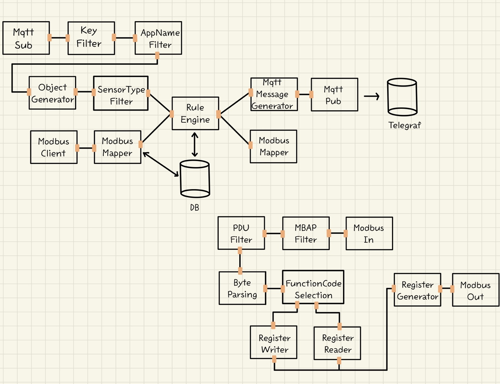

# xFlow2 프로젝트

## 소개

xFlow2 프로젝트는 다양한 센서 및 기기와 연동하여 데이터를 수집하고 제어하는 IoT 플랫폼을 위한 프레임워크입니다. 프로젝트는 MQTT 및 Modbus와 같은 통신 프로토콜을 사용하여 데이터를 주고받으며, 사용자가 정의한 규칙에 따라 데이터를 처리합니다.

</img>

## 구성 요소

### Checker 패키지

1. **Checker 클래스:**

    - JSON 데이터의 특정 조건을 확인하며 검증하는 클래스입니다.

2. **JSONKeyStrategy 클래스:**

    - JSON 데이터의 Key에 대한 조건을 확인하는 전략 클래스입니다.

3. **JSONValueStrategy 클래스:**

    - JSON 데이터의 Value에 대한 조건을 확인하는 전략 클래스입니다.

4. **MBAPStrategy 클래스:**

    - MBAP(Modbus Application Protocol)에 대한 조건을 확인하는 전략 클래스입니다.

5. **PDUStrategy 클래스:**
    - PDU(Modbus Protocol Data Unit)에 대한 조건을 확인하는 전략 클래스입니다.

### Client 패키지

1. **ModbusClient 클래스:**

    - Modbus 기기와 통신하는 클라이언트 클래스입니다.

2. **MqttSubscriber 클래스:**

    - MQTT 브로커로부터 데이터를 구독하는 클래스입니다.

3. **MqttPublisher 클래스:**
    - MQTT 브로커에 데이터를 발행하는 클래스입니다.

### Message 패키지

1. **JSONMessage 클래스:**

    - JSON 형식의 메시지를 나타내는 클래스입니다.

2. **MqttMessageGenerator 클래스:**
    - MQTT 메시지를 생성하는 클래스입니다.

### Node 패키지

1. **ObjectGenerator 클래스:**

    - 데이터 객체를 생성하는 노드 클래스입니다.

2. **Filter 클래스:**

    - 데이터를 필터링하는 노드 클래스입니다.

3. **RuleEngine 클래스:**
    - 규칙을 적용하여 데이터를 처리하는 노드 클래스입니다.

### Port 패키지

1. **InputPort 클래스:**

    - 노드의 입력 포트를 나타내는 클래스입니다.

2. **OutputPort 클래스:**
    - 노드의 출력 포트를 나타내는 클래스입니다.

### Register 패키지

1. **RegisterReader 클래스:**

    - 데이터를 읽어오는 클래스입니다.

2. **RegisterUpdater 클래스:**

    - 데이터를 업데이트하는 클래스입니다.

3. **RegisterWriter 클래스:**
    - 데이터를 기록하는 클래스입니다.

### Splitter 패키지

1. **JSONSplitter 클래스:**
    - JSON 형식의 데이터를 분할하는 클래스입니다.

### CommonTopicGenerator 클래스

-   공통 주제를 생성하는 클래스입니다.

### App 클래스

-   프로젝트를 실행하는 메인 클래스입니다.

### ModbusServerTest 클래스

-   Modbus 서버를 테스트하는 클래스입니다.

### ModbusUpdateTest 클래스

-   Modbus 업데이트를 테스트하는 클래스입니다.

### MqttTest 클래스

-   MQTT를 테스트하는 클래스입니다.

### Test 폴더

-   테스트를 위한 클래스 및 파일이 위치한 폴더입니다.

## 사용 방법

1. `XFlow2` 클래스를 실행하여 프로젝트를 시작합니다.
2. 설정 파일 및 규칙 업데이트가 필요한 경우, 해당 파일을 수정합니다.
3. 각 기능을 테스트하고 결과를 확인합니다.

이제 README 파일을 참고하여 프로젝트의 사용 방법 및 구성 요소에 대한 정보를 확인할 수 있습니다.
